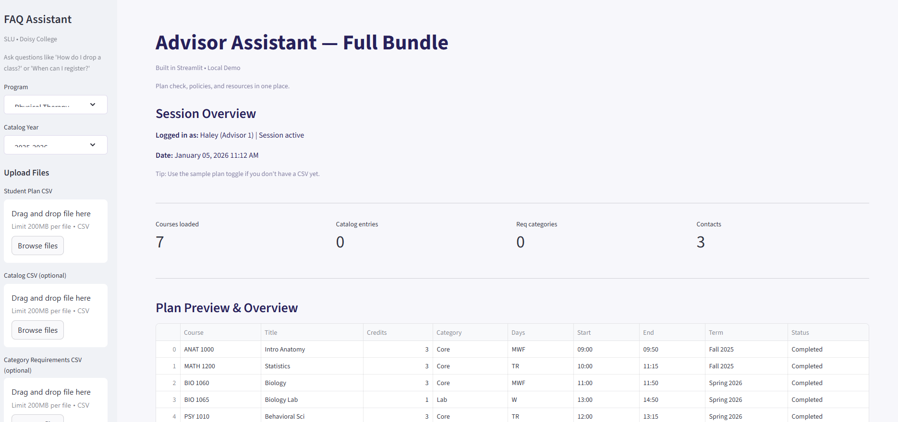
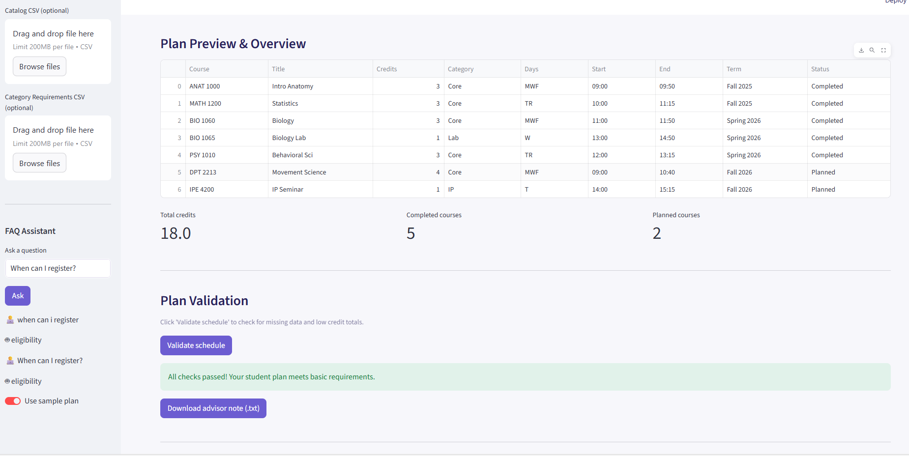
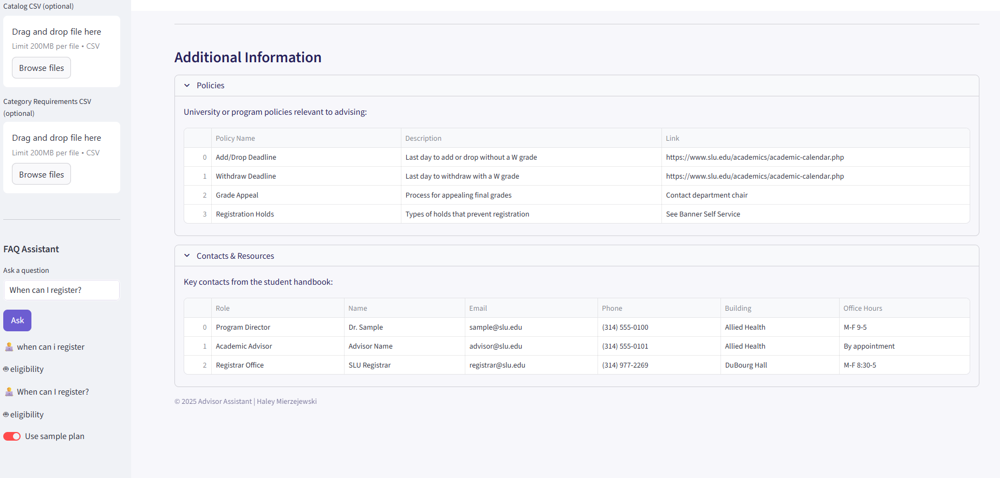

# AI Advising Assistant

A local, offline Streamlit dashboard for reviewing student course plans and answering advising FAQs for Saint Louis University's Physical Therapy program. Built FERPA-compliant with no external API calls—all processing happens on your machine.

## Screenshots

### Main Dashboard

*Dashboard showing session overview, file uploads, and FAQ assistant*

### Plan Validation

*Course plan table with automated validation and export options*

### Policies & Contacts

*Quick reference tables for university policies and department contacts*

## What It Does

**Plan Validator** – Upload a student's course plan CSV to check for:
- Missing required fields (credits, categories)
- Duplicate or incomplete entries
- Total credit hours by category
- Prerequisites and corequisites (if included in your catalog)

**FAQ Assistant** – Local keyword and fuzzy matching against a CSV of common questions. No GPT, no API costs, no data leaving your computer. Ask things like:
- "When should I take anatomy?"
- "How do I study abroad?"
- "Who clears my advising hold?"

**Policy & Contact Tables** – Quick reference for program policies and department contacts, loaded from CSV.

## Why This Approach

- **FERPA-safe**: Student data never touches external servers
- **No API costs**: Fuzzy matching instead of LLM calls keeps it free
- **Advisor-facing**: Built for staff who work with multiple students per day
- **Lightweight**: Runs on any laptop, no cloud setup required

## Tech Stack

- **Frontend**: Streamlit
- **Data Processing**: Pandas
- **Search**: FuzzyWuzzy/SequenceMatcher (Python stdlib)
- **Storage**: Local CSV files

## Installation
```bash
# Clone the repo
git clone https://github.com/hmierz/AI-Advising-Assistant.git
cd AI-Advising-Assistant

# Create virtual environment
python -m venv advisor-env

# Activate environment
advisor-env\Scripts\activate  # Windows
source advisor-env/bin/activate  # Mac/Linux

# Install dependencies
pip install streamlit pandas

# Run the app
streamlit run streamlit_app.py
```

Open your browser to `http://localhost:8501` and you're ready to go.

**Detailed setup instructions**: See [SETUP.md](SETUP.md)

## CSV File Structure

The app expects these files in the `app/` folder:

| File | Required Columns | Optional Columns | Purpose |
|------|-----------------|------------------|---------|
| `faq.csv` | Question, Answer | Tags | Powers the FAQ search |
| `core_map_simplified.csv` | Category, RequiredCredits | - | Validates credit totals by category |
| `policies_simplified.csv` | Any columns | - | Displays policy reference table |
| `contacts.csv` | Any columns | - | Displays contact information |

**Student Plan Upload** (user-provided):
- **Required**: `Credits`, `Category`
- **Optional**: `CourseID`, `Status` (Planned/Completed), `Days`, `Start`, `End`, `Term`
- The app auto-detects common aliases like "Credit Hours", "Cr", "Area", "Type", etc.

Sample data is generated automatically if you don't have CSVs ready.

## Features in Action

**Column Auto-Detection**: Handles variations like "Credit Hours" vs "Cr" vs "Units"—just upload your CSV and the app figures it out.

**Flexible Validation**: Checks credit totals, flags missing data, and optionally validates prerequisites if your catalog includes them.

**Export Options**: Download validation results as CSV or generate an advisor note as TXT for student files.

**Session Memory**: FAQ chat history and validation notes persist during your session for easy reference.

## Current Limitations & Future Work

This is a proof-of-concept built as part of my analytics portfolio. It demonstrates:
- FERPA-compliant data handling
- Offline NLP techniques (fuzzy matching)
- CSV-based workflow automation
- User interface design with Streamlit

**Known limitations:**
- FAQ matching works best for exact phrasing; needs better synonym handling
- Validation logic is basic; production would need program-specific rules
- Currently single-program focused (PT); needs multi-program architecture

**Next steps for production readiness:**
- Integrate with SLU's course catalog API for real-time prerequisite checking
- Add more sophisticated NLP (embedding-based semantic search)
- Build out program-specific validation rules engine
- Add user authentication and session persistence
- Create advisor dashboard with aggregate metrics across students

## Future Plans

- [ ] Student-facing version with form input instead of CSV upload
- [ ] Scrape SLU course catalog for automated prerequisite/corequisite detection
- [ ] Rule engine for program-specific advising checks (e.g., "must take X before Y")
- [ ] PDF transcript parsing from DegreeWorks
- [ ] Multi-program support beyond PT (OT, AT, Nutrition)
- [ ] Deploy to Streamlit Cloud for web access

## License

MIT License - see `LICENSE` file for details.

## Contact

Haley Mierzejewski
[GitHub](https://github.com/hmierz) • [LinkedIn](https://linkedin.com/in/haley-mierz)

Built as as a personal assistant to my role as an academic advisor at Saint Louis University.
